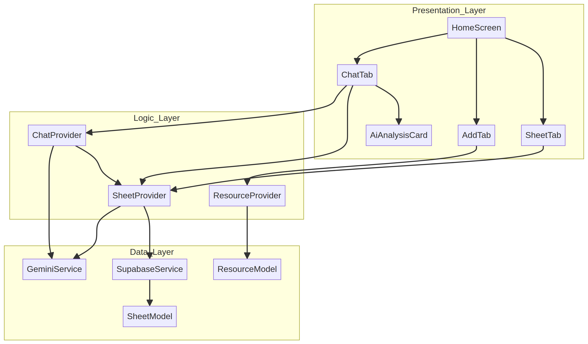

# AI-Powered Spreadsheet & Accounting App (Refactored)

A production-ready Flutter mobile application that combines spreadsheet management, resource tracking, and AI-powered data analysis.

## 🏗️ Architecture Overview

The project has been refactored from a monolithic structure into a **Layered Architecture** using **Riverpod** for state management. This ensures scalability, testability, and clean separation of concerns.

### Project Structure

| Directory | Purpose |
|-----------|---------|
| `lib/core/` | Global constants, themes, and shared utilities. |
| `lib/data/models/` | Data entities (Sheets, Resources, Rows). |
| `lib/data/services/` | External API clients (Supabase, Gemini). |
| `lib/logic/providers/` | State management and business logic. |
| `lib/presentation/screens/` | Main UI screens and tab views. |
| `lib/presentation/widgets/` | Reusable UI components. |

### 📊 Architecture Diagram

## 🚀 Features

- **📊 AI Spreadsheet (Sheet Tab):** Create dynamic spreadsheet schemas using natural language.
- **➕ Resource Management (Add Tab):** Manage documents, links, and text resources.
- **💬 AI Chat (Chat Tab):** Ask Gemini questions about your spreadsheet data or insert new rows via natural language.
- **☁️ Supabase Integration:** Persistent storage for sheets and row data.
- **🤖 Gemini 1.5 Flash:** High-speed AI for schema generation and data extraction.

## 🛠️ Tech Stack

- **Framework:** Flutter (Dart SDK >=3.4.3 <4.0.0)
- **State Management:** Riverpod
- **Backend:** Supabase
- **AI Model:** Google Gemini 1.5 Flash
- **Theme:** Dark Navy + Cyan Accent (Material 3)

## 🔑 API Contracts

### Supabase Tables
- `user_sheets`: `id (uuid)`, `title (text)`, `schema (jsonb)`, `created_at (timestamptz)`
- `sheet_data`: `id (uuid)`, `sheet_id (uuid)`, `row_data (jsonb)`, `created_at (timestamptz)`

### Gemini Prompts
- **Schema Generation:** Returns a JSON array of `{column_name, column_type}`.
- **Data Extraction:** Returns a JSON object mapping columns to extracted values.
- **Data Analysis:** Returns a natural language summary of the provided JSON data.

## 🤝 Contribution Guide

1. **Setup:** Ensure you have Flutter SDK and Android SDK installed.
2. **Dependencies:** Run `flutter pub get` to install Riverpod and other dependencies.
3. **Environment:** Update `lib/core/constants.dart` with your own Supabase and Gemini keys.
4. **Formatting:** Follow the layered structure when adding new features.
5. **PRs:** Ensure all new services are documented in the `lib/data/services/` directory.

---
*Refactored with ❤️ by Manus*
